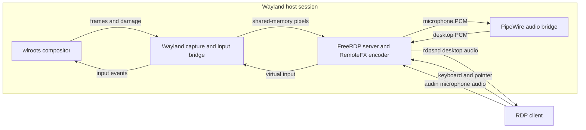

# wayrdp

`wayrdp` is a small native RDP server for wlroots-based Wayland compositors. It
shares the desktop session that is already running: an RDP client sees the same
screen as the local user and can control it with a remote keyboard and pointer.

The server uses standard Wayland and wlroots protocols for capture and input,
FreeRDP 3 for the RDP transport and RemoteFX encoding, and PipeWire for
bidirectional audio. It is not tied to a particular desktop shell.

> [!IMPORTANT]
> `wayrdp` is an early, working implementation rather than a security-audited
> production remote-access service. Read the [security notes](#security) before
> exposing it outside a trusted network.

## Why this project exists

Remote desktop support on Wayland is compositor-specific. An X11 shadow server
cannot capture or inject input into a native Wayland session, while RDP servers
built for GNOME depend on Mutter-specific interfaces. On a wlroots desktop, the
usual remaining option is VNC.

`wayrdp` fills that gap by joining the current Wayland session directly and
translating between two sides:

- Wayland protocols provide frames, damage regions, pointer events and keyboard
  events.
- FreeRDP exposes those capabilities to standard RDP clients.
- PipeWire carries desktop sound to the client and publishes the client's
  microphone back into the desktop.

It does not start a nested compositor, create a separate login session or run
applications in a virtual desktop. The local and remote users share one real
session.

## Current status

The core remote-desktop path is implemented and usable:

- capture of the existing Wayland output;
- damage-based incremental screen updates;
- an immediate full capture when a client first connects;
- RemoteFX encoding through FreeRDP 3;
- pointer movement, three mouse buttons and vertical scrolling;
- keyboard input, modifiers, lock keys and compositor shortcuts;
- keyboard-layout discovery through XKB environment variables or
  `systemd-localed` configuration;
- TLS transport with an automatically generated self-signed certificate;
- username and password validation, from either a plaintext secret or a salted
  scrypt hash;
- desktop audio sent to the RDP client;
- client microphone exposed as a PipeWire source;
- sequential reconnects, with one active client at a time;
- a readiness check and a standalone compositor probe.

The following are not implemented yet:

- clipboard redirection;
- multiple monitors or output selection;
- concurrent clients;
- desktop scaling or a client-selected resolution;
- per-window capture;
- an automated test suite.

The first `wl_output` announced by the compositor is served at its native
resolution. A second simultaneous connection is deliberately refused so that
two remote users cannot fight over the same screen and input devices.

## How it works



The streaming capture path only completes a frame when the compositor reports
screen damage. An idle desktop therefore produces no video traffic. When a new
client activates, the screencopy path requests a complete frame immediately so
the client does not have to wait for something on screen to change.

Frames arrive in a Wayland shared-memory buffer. Supported 24-bit and 32-bit
pixel formats are converted into a persistent BGRX32 mirror, but only inside
the damaged rectangles. FreeRDP then encodes those rectangles as RemoteFX
surface commands.

RDP set-1 keyboard scancodes are translated to Linux evdev key codes. Extended
keys are mapped explicitly, and modifier state is sent separately because the
virtual-keyboard protocol does not derive it automatically.

## Performance

The RemoteFX encoder is created with threading disabled on purpose. FreeRDP's
default WinPR thread pool spawns one worker per available CPU and, measured on a
1080p output, contends badly enough that turning it off dropped the server's CPU
roughly four times for the same frame rate. A single encoder thread is both
cheaper and no slower here.

The pixel repack into the BGRX32 mirror is likewise format-specialised: the
compositor offers a single pixel format for the whole session, so the byte order
and the 24- to 32-bit expansion are decided once per rectangle instead of being
re-tested for every pixel.

## Protocols and libraries

| Purpose | Interface or library | Role |
| --- | --- | --- |
| Incremental capture | `ext-image-copy-capture-v1` | Captures frames and reports damage regions |
| Output capture source | `ext-image-capture-source-v1` | Selects a compositor output as the capture source |
| Initial full frame | `wlr-screencopy-unstable-v1` | Captures the current output immediately after activation |
| Remote pointer | `wlr-virtual-pointer-unstable-v1` | Injects absolute movement, buttons and scrolling |
| Remote keyboard | `virtual-keyboard-unstable-v1` | Injects evdev keys, modifiers and an XKB keymap |
| RDP server | FreeRDP 3 and WinPR | Listener, TLS, authentication, input, channels and RemoteFX |
| Audio | PipeWire 0.3 | Captures the default sink and publishes a remote microphone |

The Makefile also generates bindings for `ext-foreign-toplevel-list-v1`, but
the runtime does not currently use them; per-window capture remains future
work.

## Requirements

### Host session

`wayrdp` must run as the same user and inside the same graphical session as the
desktop being shared. Core startup requires the compositor to advertise:

- `wl_shm`, `wl_seat` and at least one `wl_output`;
- `ext_output_image_capture_source_manager_v1`;
- `ext_image_copy_capture_manager_v1`;
- `zwlr_virtual_pointer_manager_v1`;
- `zwp_virtual_keyboard_manager_v1`.

`zwlr_screencopy_manager_v1` is also expected for the immediate full frame on
client activation. Without it, the server can start, but the initial desktop
paint is unavailable until the incremental capture path receives new damage.

On Wayfire, the `copy-capture` plugin must be present in `core/plugins` for the
ext-image-copy-capture interfaces to be available. Other wlroots compositors
can work if they expose the same protocols and allow the client to use them.

The RDP client must support surface commands and RemoteFX. Clients that do not
negotiate both are rejected rather than being left with a blank window.

### Build dependencies

The build uses C11, Make, `pkg-config` and `wayland-scanner`. It expects these
pkg-config modules:

```text
wayland-client
xkbcommon
freerdp3
freerdp-server3
winpr3
libpipewire-0.3
libcrypto
```

It also needs the staging XML files from `wayland-protocols`, the unstable XML
files from `wlr-protocols`, Linux input-event headers, and OpenSSL at runtime to
create the first TLS certificate.

The supplied Makefile currently uses the protocol locations installed by Arch
Linux:

```text
/usr/share/wayland-protocols/staging
/usr/share/wlr-protocols/unstable
```

On another distribution, install equivalent development packages and adjust
`STAGING` and `WLR` in the Makefile if those files live elsewhere.

## Arch Linux package

An AUR package definition named `wayrdp` is available in the root
[`PKGBUILD`](PKGBUILD). To build and install it locally from the project root:

```bash
sudo pacman -S --needed base-devel
makepkg --syncdeps --install
```

It installs both `wayrdp` and `wayrdp-probe` under `/usr/bin`, a
`wayrdp.service` user unit, and documentation and licenses under `/usr/share`.
The package currently uses a fixed upstream commit and the supplied patch;
additional local source edits are not included in this build. In the source
checkout, `makepkg` uses `build/makepkg` to protect the project's `src/` directory.

After installation, create the [per-user configuration](#configuration) and run
`wayrdp --check` inside the Wayland session before starting the server.

## Building on Arch Linux

Install the toolchain and dependencies:

```bash
sudo pacman -S --needed \
  base-devel wayland wayland-protocols wlr-protocols \
  libxkbcommon freerdp libpipewire openssl
```

Build both executables:

```bash
make
```

The generated protocol bindings and binaries are written under `build/`:

```text
build/wayrdp
build/wayrdp-probe
build/gen/
```

Install the server, and optionally the diagnostic probe:

```bash
sudo install -Dm755 build/wayrdp /usr/local/bin/wayrdp
sudo install -Dm755 build/wayrdp-probe /usr/local/bin/wayrdp-probe
```

Useful build targets:

```bash
make protocols  # generate only the Wayland protocol bindings
make clean      # remove the complete build directory
```

## Configuration

By default, the server reads:

```text
${XDG_CONFIG_HOME}/wayrdp/wayrdp.conf
```

When `XDG_CONFIG_HOME` is unset, this becomes:

```text
~/.config/wayrdp/wayrdp.conf
```

Set `WAYRDP_CONFIG` to use a different file.

Create the configuration directory with private permissions and add a config:

```bash
install -d -m 700 "${XDG_CONFIG_HOME:-$HOME/.config}/wayrdp"
${EDITOR:-vi} "${XDG_CONFIG_HOME:-$HOME/.config}/wayrdp/wayrdp.conf"
chmod 600 "${XDG_CONFIG_HOME:-$HOME/.config}/wayrdp/wayrdp.conf"
```

Example configuration:

```ini
# Default RDP port
port = 3389

# Use 127.0.0.1 for an SSH tunnel, a private interface address, or 0.0.0.0
# to listen on every interface.
bind = 127.0.0.1

username = danilo

# Printed by: wayrdp --hash-password
password_hash = scrypt$ln=15,r=8,p=1$c2FsdA==$a2V5
```

| Key | Required | Default | Description |
| --- | --- | --- | --- |
| `port` | No | `3389` | TCP port from 1 through 65535 |
| `bind` | No | `0.0.0.0` | Address passed to the FreeRDP listener |
| `username` | Yes | None | RDP login name |
| `password_hash` | Yes* | None | Salted scrypt hash, as printed by `wayrdp --hash-password` |
| `password` | Yes* | None | Plaintext password, kept for compatibility; ignored when a hash is present |

Blank lines, surrounding whitespace and comments beginning with `#` are
accepted. Unknown keys are ignored. The server refuses to listen unless a
username and either a non-empty `password` or a valid `password_hash` are
configured.

### Hashing the password

The server only has to verify a password, never recover it, so it needs a hash,
not the secret itself. Generate one from a terminal:

```bash
wayrdp --hash-password
```

It reads the password without echo and prints a self-describing scrypt string to
put after `password_hash =`. (It also accepts the password on standard input, so
a panel can pipe it instead of prompting.) Every run uses a fresh random salt,
so hashing the same password twice yields different values. A leaked
configuration file then yields no usable secret, and there is no key to protect
the way reversible encryption would need.

## Checking compatibility

Run the readiness check from a terminal inside the Wayland session:

```bash
wayrdp --check
```

It verifies the configuration, connects to the compositor, opens capture and
virtual input, and reports whether PipeWire is available. It does not open the
RDP port.

Example output:

```text
compositor: capture and input available, 2560x1440
audio:      PipeWire, sound and microphone
config:     /home/user/.config/wayrdp/wayrdp.conf
ready:      yes, port 3389 as 'user'
```

Exit statuses are:

| Status | Meaning |
| --- | --- |
| `0` | Compositor and configuration are ready |
| `1` | Startup, configuration-file or compositor error |
| `3` | Compositor works, but the configuration is not usable |

### Compositor probe

`wayrdp-probe` exercises the Wayland half without opening an RDP listener. It
moves the pointer, captures a frame, writes it as a PPM image and injects a
Shift press and release:

```bash
wayrdp-probe frame.ppm
```

Two optional second arguments test keyboard behavior:

```bash
wayrdp-probe frame.ppm --type     # type "abc" and Enter into the focused app
wayrdp-probe frame.ppm --binding  # send Super+W to the compositor
```

The probe injects real input into the current session. Focus a harmless test
window first, especially before using `--type` or `--binding`.

## Running the server

Start it as the logged-in desktop user, from the session that should be shared:

```bash
wayrdp
```

Do not launch it with `sudo`: that changes the user, home directory, Wayland
socket and PipeWire session it can access.

When `WAYLAND_DISPLAY` is unavailable, as can happen in a systemd user service,
the server searches `XDG_RUNTIME_DIR` for `wayland-*` sockets and selects the
oldest one. The selected socket is printed to standard error. Explicitly
setting the correct `WAYLAND_DISPLAY` is preferable on systems with more than
one long-lived compositor.

Stop the server with `Ctrl+C`, `SIGINT` or `SIGTERM`. After a client disconnects,
the listener remains available for the next client.

The Arch package also includes a systemd user unit. After configuring the server,
import the session environment and enable it from a terminal in that session:

```bash
systemctl --user import-environment WAYLAND_DISPLAY XDG_RUNTIME_DIR
systemctl --user enable --now wayrdp.service
```

Autostart uses `graphical-session.target`. If the compositor does not activate
that target, its session startup must import the display environment and start
the enabled unit.

An existing `~/.config/systemd/user/wayrdp.service` overrides the packaged unit.
If it hardcodes `/usr/local/bin/wayrdp`, change it to `ExecStart=wayrdp` and run
`systemctl --user daemon-reload`. Local installations under `/usr/local/bin`
take precedence over the packaged binary under `/usr/bin`.

Connect with an RDP client to the host and configured port, supply the configured
username and password, and verify the self-signed certificate fingerprint on
the first connection. The client window is resized to the selected output's
native dimensions.

## Audio

Audio is optional: failure to initialize it does not prevent screen sharing or
remote input.

### Desktop to client

The speaker path captures the monitor of PipeWire's default output, so it also
hears applications that were already running when the RDP client connected.
Internally the stream is signed 16-bit PCM, stereo, at 48 kHz.

The RDP sound channel offers AAC first and PCM as a fallback. AAC is preferred
because some FFmpeg-backed FreeRDP clients interpret RDP's signed 16-bit PCM as
unsigned PCM, turning silence into full-scale noise. The PipeWire capture stream
is created only after the client opens and negotiates the sound channel.

### Client microphone to desktop

The microphone channel accepts 16-bit PCM at 44.1 or 48 kHz, mono or stereo.
After negotiation, PipeWire publishes a source named **Remote microphone** with
the client's exact format. Desktop applications can select it like any other
microphone. The source exists only while a client is sharing microphone audio.

Both directions use bounded ring buffers. If either side stalls, old audio is
dropped instead of increasing latency indefinitely.

## Keyboard layout

The virtual keyboard needs its own XKB keymap. `wayrdp` resolves it in this
order:

1. `XKB_DEFAULT_RULES`, `XKB_DEFAULT_MODEL`, `XKB_DEFAULT_LAYOUT`,
   `XKB_DEFAULT_VARIANT` and `XKB_DEFAULT_OPTIONS`, when present;
2. matching `Xkb*` options in `/etc/X11/xorg.conf.d/00-keyboard.conf`;
3. the XKB defaults, normally the US layout.

The chosen layout is printed when virtual input starts. If remote keys produce
the wrong characters, set the appropriate `XKB_DEFAULT_*` variables in the
environment used to start `wayrdp`.

## Debugging

The following environment variables enable focused diagnostics. Their presence
enables logging, so unset them to turn it off.

| Variable | Output |
| --- | --- |
| `WAYRDP_DEBUG_INPUT=1` | Incoming RDP scancode, extended flag, evdev mapping and press/release state |
| `WAYRDP_DEBUG_AUDIO=1` | Channel negotiation, bytes transferred each second and peak sample values |
| `WAYRDP_CONFIG=/path/to/file` | Uses an alternate configuration file; this changes behavior rather than logging |

Common failures:

| Message or symptom | What to check |
| --- | --- |
| `no Wayland display` | Run as the desktop user and verify `XDG_RUNTIME_DIR` and `WAYLAND_DISPLAY` |
| `compositor does not offer ext-image-copy-capture` | Enable the compositor's capture support; on Wayfire, add `copy-capture` to `core/plugins` |
| Missing virtual pointer or keyboard | Confirm the compositor exposes and authorizes the wlroots input protocols |
| No frame from `wayrdp-probe` | Wake the output and cause visible screen damage before the timeout |
| `could not bind the port` | Check the bind address, firewall and whether another process owns the port |
| Certificate generation failure | Install `openssl` and check access to `~/.local/share/wayrdp` |
| Client is refused before showing a desktop | Use a client that negotiates surface commands and RemoteFX |
| Silent or distorted audio | Enable `WAYRDP_DEBUG_AUDIO`, then inspect the selected client format and byte/peak counters |
| Wrong keyboard characters | Set the correct XKB layout or update the system keyboard configuration |

## Security

The current security model is intentionally simple and should be understood
before deployment:

- The default bind address is `0.0.0.0`, which listens on every interface.
  Prefer a specific private address, localhost plus an SSH tunnel, a VPN, or a
  strict firewall rule.
- RDP traffic and credentials travel inside TLS. NLA is disabled.
- On first server start, OpenSSL creates a self-signed RSA certificate valid for
  3650 days at `~/.local/share/wayrdp/tls.crt`, with its key at
  `~/.local/share/wayrdp/tls.key`.
- The private key is set to mode `0600`. Clients must validate and remember the
  certificate fingerprint themselves.
- The configured password is compared without returning at the first mismatched
  byte. Prefer `password_hash`, a salted scrypt value, so the file holds no
  recoverable secret; a plaintext `password` is still accepted for compatibility
  and should be protected with mode `0600`.
- There is no brute-force throttling, account lockout, external identity provider
  or security audit.

Do not expose the server directly to the public internet in its current form.

## Source layout

```text
.
├── Makefile
├── protocols/
│   └── virtual-keyboard-unstable-v1.xml
└── src/
    ├── main.c       Process lifecycle, readiness check and signal handling
    ├── config.c     Config parsing, validation and TLS certificate creation
    ├── password.c   Salted scrypt hashing and verification
    ├── wayland.c    Output capture, shared memory and virtual input
    ├── rdp.c        FreeRDP listener, authentication, RemoteFX and channels
    ├── audio.c      PipeWire streams and synchronized ring buffers
    └── probe.c      Standalone Wayland capability test
```

The public headers keep the subsystems separate: the RDP layer consumes frames
and emits input without depending on Wayland protocol details, while the audio
layer exchanges raw samples through two ring buffers without knowing about RDP.

## Vendored protocol

`protocols/virtual-keyboard-unstable-v1.xml` is the only vendored protocol
description. It is copied from wlroots because `wlr-protocols` does not install
that XML. The file retains its MIT license notice. All other generated protocol
bindings come from the system's `wayland-protocols` and `wlr-protocols`
installations.

## Development and verification

There is no automated test suite yet. A practical verification sequence is:

```bash
make clean
make
build/wayrdp --help
build/wayrdp --check
build/wayrdp-probe frame.ppm
```

Then connect with a RemoteFX-capable RDP client and verify initial paint,
incremental updates, pointer buttons and scrolling, normal keys and shortcuts,
speaker audio, microphone publication, disconnect and reconnect.

When contributing, keep compositor-specific protocol code behind `wayland.h`
and RDP-specific channel or codec code behind `rdp.h`. Build artifacts and
generated protocol files belong under `build/` and are ignored by Git.

## License

The project is distributed under the MIT License. See [LICENSE](LICENSE).
